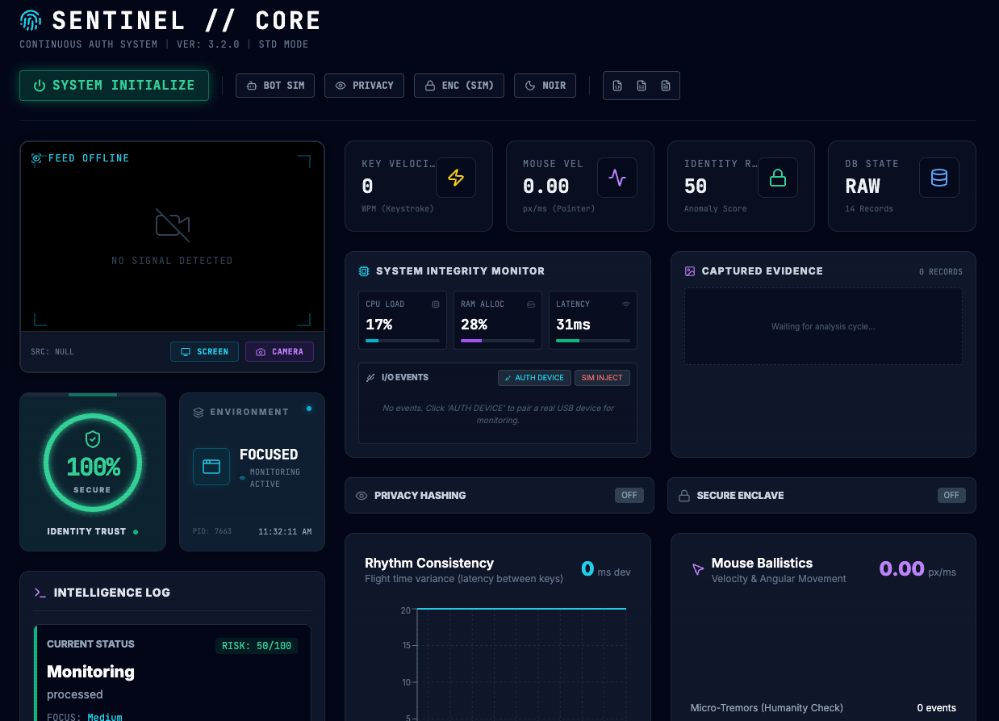

  

# Keylogger Monitoring

This project is a local research tool for observing typing behavior and related client signals to study keystroke biometrics, anomaly detection, and bot identification. It captures keyboard dynamics (timing and rhythm), tracks relevant context (such as the active window), and provides an interactive dashboard to visualize metrics and trust scoring. All analytics are performed locally to preserve privacy.

## Purpose

- Enable privacy-preserving analysis of human typing patterns and detection of abnormal or automated behavior
- Support cybersecurity and UX research with transparent, local-only telemetry and encrypted audit logs
- Provide a practical lab environment to experiment with biometric profiling and risk scoring without external data sharing

## Notes

- Artifacts like screenshots and daily logs are created locally on startup and remain on your machine
- Use responsibly and only with informed consent; the tooling is intended for research and defensive monitoring, not covert surveillance
